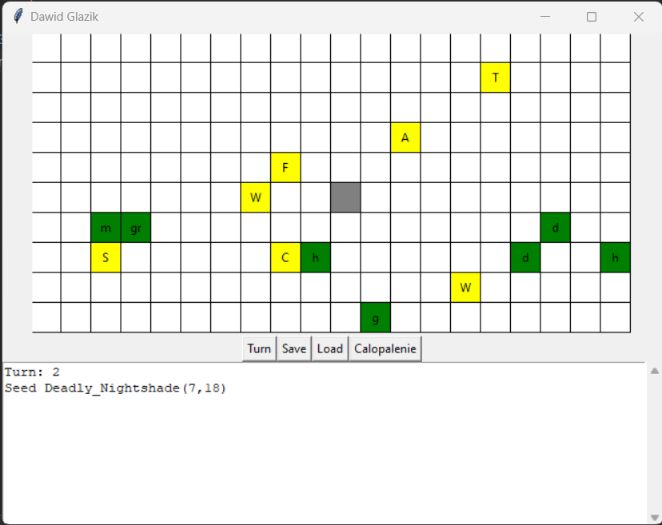

# Sim_World_Python
## World simulator in Python + Tkinter
In this project I wanted to improve my OOP skills.
### BOARD
On the board, which represents world, there are several different organisms (plants and animals) and one human. Simulator is turn-based so we can proceed with next turn by clicking the button or by moving the human with arrows.
### TURNS
Every organism has its strength, initiative and age. Initiative and age are necessary to determine which organism should conduct the action first.
### MOVEMENT
Way of moving may be different for some organisms but generally it is one square.
### COLLISION
When the collision occurs:  
  * (animal - animal) stronger wins and kills weaker one; when strengts are equal, attacking side wins
  * (animal - plant) animal eats the plant
  * (animal - animal) if animals are the same type, they reproduce
Plants can propagate.
### ACTION
Action is different for different type of organisms. For instance, hogweed kills every animal in the nearest area except cyber-sheep, fox won't move to field with organism stronger than itself, cyber-sheep goes always in nearest hogweed's direction.
### HUMAN ABILITY
Human has ability which is calopalenie. For 5 turns human kills every organism in the nearest area. 5 turns cooldown.
### Preview

